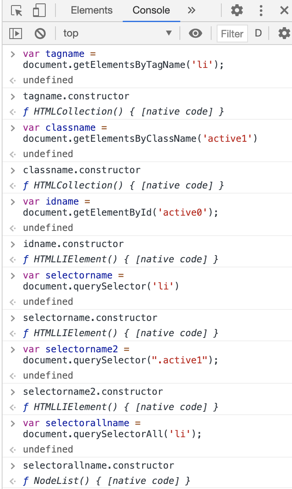

# 객체 모델

WEB은 다음과 같은 객체 모델을 통해 동작된다. DOM, BOM, JavaScript 각 모델들을 통해 웹 브라우저가 웹 페이지를 읽고 자바스크립트를 통해 동작 된다. 이 동작들이 일어나는 요소들은 객체로 작동된다.

출처: <https://learn.javascript.ru/browser-environment>

* DOM: 웹 페이지를 제어
* BOM : 웹 브라우저를 제어
* JavaScript

---

# DOM 

* 웹 페이지를 제어하는 객체 모델이다. 
* 웹 페이지의 요소들은 태그(element)로 제어할 수 있기 때문에 해당 element를 찾는것이 중요하다.

## 제어 대상 찾기

querySelectorAll을 제외한 모든 메서드의 반환값은 단수인 경우 `HTMLElement()` 복수인 경우 `HTMLCollection`이다. querySelectorAll의 경우 `NodeList()`로 반환된다. 

* document.getElementsByTagName
* document.getElementsByClassName
* document.getElementById
* document.querySelector
* document.querySelectorAll

~~~
<!DOCTYPE html>
<html>
<body>
<ul>
    <li>HTML</li>
    <li id="active0" class="active1">CSS</li>
    <li class="active1">JavaScript</li>
</ul>
</body>
</html>
~~~

## jQuery

* DOM을 내부에 감추고 보다 쉽게 웹페이지를 조작할 수 있도록 돕는 도구
* 제어 대상자를 찾고 메서드를 적용시켜야 하는 보통의 경우를 간단하게 해준다. 

---

# 제어 대상

* 모든 element들은 HTMLElement의 자식이다.
* HTMLElement, HTMLLICollection 등으로 구성된다.
* getElement* 메소드를 통해 객체를 조회후 객체를 대상으로 작업을 처리해야한다. 이때 객체가 무엇이며 어떤 상속관계를 가지고 있는냐에 따라 적용할 수 있는 메서드가 달라지기 때문에 제어 대상이 뭔지 알아야 한다. 