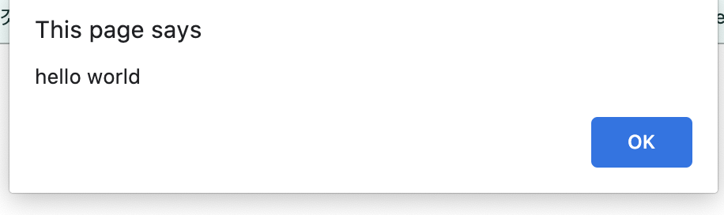
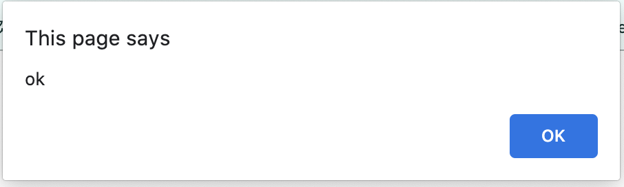
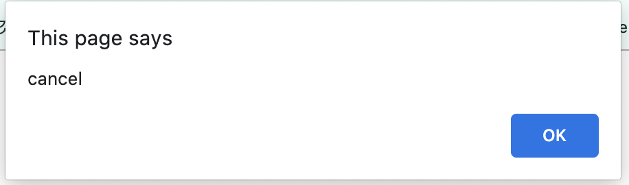
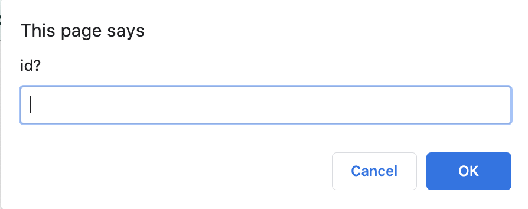

# BOM
* browser object model
* 웹 브라우저를 제어하기 위해서 브라우저가 제공해주는 객체들
* 브라우저의 창이나 프레임을 제어한다. 

---

## 전역객체 Window

* Window 객체는 모든 객체가 소속된 객체이고, 전역객체이면서, 창이나 프레임을 의미한다.
* 전역변수와 함수는 결국 window 객체의 프로퍼티와 메소드이다.
* 모든 객체는 window의 자식이다.

~~~
//윈도우 객체 접근
window

//document 객체 접근
window.document

//nevigator 객체 접근
window.nevigator
~~~

### 전역객체

* 메서드가 아닌 함수의 의미이지만 전역 객체의 메서드라고 볼 수 있다.
* 생략해도 같은 의미를 갖는다. 

~~~
<!DOCTYPE html>
<html>

<body>
 
</body>
</html>
~~~

* 전역변수에 접근 하는 방법도 동일하다.
* 전역변수라는 것은 결국 window 객체의 프로퍼티를 만드는 것이다. 
~~~
!DOCTYPE html>
<html>

<body>
 
</body>
</html>
~~~

~~~
<!DOCTYPE html>
<html>

<body>
 
</body>
</html>
~~~

---

## 사용자와 커뮤티케이션 하기

### alert

* 경고창
* 사용자에게 정보를 제공하거나 디버깅등의 용도로 사용된다.
* 버튼을 누르기 전까지 아무것도 실행되지 않는다. 

~~~
<!DOCTYPE html>
<html>
    <body>
        <input type="button" value="alert" onclick="alert('hello world');" />
    </body>
</html>
~~~

## confirm

* 확인을 누르면 true, 취소를 누르면 false를 리턴한다. 

~~~
<!DOCTYPE html>
<html>
    <body>
        <input type="button" value="confirm" onclick="func_confirm()" />
        
    </body>
</html>
~~~

* ok를 누르면 ok 출력

* cancel을 누르면 cancel 출력

## prompt
* 사용자가 입력한 값을 받아서 자바스크립트가 얻어낼 수 있는 기능

~~~
<!DOCTYPE html>
<html>
    <body>
        <input type="button" value="prompt" onclick="func_prompt()" />
        
    </body>
</html>
~~~

---

## Location 객체

* 문서의 주소와 관련된 객체로 windon 객체의 프로퍼티이다. 
* 현재 열려있는 페이지의 주소를 얻어낼 수 있다. 
* window 문서의 url을 변경할 수 있다.
* 문서의 위치와 관련해서 여러 정보를 얻을 수 있다. 

### 현재 윈도우의 url 알아내기

* location.toString()과 location.href 같은 결과 나타난다. 
~~~
console.log(location.toString(), location.href);
~~~

~~~
// location 정보를 문자열화해서 나타낸다.
alert(location)

// 관련 객체 속성들을 모두 보여준다.
console.log(location)
~~~

### url 파싱

~~~
console.log(location.protocol, location.host, location.port, location.pathname, location.search, location.hash)
~~~

~~~
http  ://  opentutorials.org  :80  /module/1  ?id=1  #hash
protocol    host             port  pathname   search   hash
~~~

~~~
//http, https 
console.log(location.protocol)

console.log(location.host)

console.log(location.port)

console.log(location.pathname)

console.log(location.search)

console.log(location.hash)
~~~

### URL 변경하기 

* 특정 주소로 이동시킨다. 
~~~
location.href = 'http://egoing.net';

location = 'http://egoing.net'
~~~

* 현재 문서 리로드
~~~
location.reload();
~~~

---

## Navigator 객체

* 브라우저의 정보를 제공하는 객체 -> 호환성 문제등을 위해서...
* 현재 자바스크립트가 실행되고 있는 브라우저의 제품명, 버전

~~~
cross browsing 이슈

아주 많은 browser가 존재 -> ie, ff, chrome, sa, op
w3c(표준화기구) 에서 정의한 스팩에 맞게 구현되었다. 정의되지 않은 부분은 각자 모두 다르게 구현되었다. 브라우저마다 코드가 다른 결과를 만들어 낸다. 따라서 각 브라우저 마다 특성에 맞게 구현되어야 한다. 

최초의 웹 브라우저는 팀 버너스리가 만들어 낸다. 
최초 상용화에 성공한 브라우저는 netscape이며 javascript를 만들어낸다.
ms에서 internetexplore를 만들고 서로 경쟁을 하면서 새로운 기능들을 만들어 낸다.  

모든 브라우저마다 특정 기능을 같은 형식으로 구현할 수 있게 웹 표준을 만들어 낸다. 업체들을 표준에 정의된 스펙에 따라서 개발이 진행되고 있다.
~~~

### navigator 프로퍼티들..

~~~
// navigator 의 프로퍼티들을 살펴볼 수 있다.
console.dir(navigator)

// 웹브라우저의 이름
console.dir(navigator.appName);

//웹브라우저의 버전
console.dir(appVersion);

// 브라우저가 서버측으로 전송하는 USER-AGENT HTTP 헤더의 내용
console.dir(userAgent);

// 브라우저가 동작하고 있는 운영체제
navigator.platform
~~~

### 기능 테스트

* 특정 브라우저에 사용하고자 하는 api를 파악하는 일

## 창 제어

* window.open, window.close 메소드는 새 창을 열고 닫는다. 

~~~
<!DOCTYPE html>
<html>

<body>
<ul>
    <li>
        첫번째 인자는 새 창에 로드할 문서의 URL이다. 인자를 생략하면 이름이 붙지 않은 새 창이 만들어진다. 
        <input type="button" onclick="open1()" value="window.open('demo2.html');" />
    </li>
    <li>
        두번째 인자는 새 창의 이름이다. _self는 스크립트가 실행되는 창을 의미한다. 
        <input type="button" onclick="open2()" value="window.open('demo2.html', '_self');" />
    </li>
    <li>
        _blank는 새 창을 의미한다.  
        <input type="button" onclick="open3()" value="window.open('demo2.html', '_blank');" />
    </li>
    <li>
        창에 이름을 붙일 수 있다. open을 재실행 했을 때 동일한 이름의 창이 있다면 그곳으로 문서가 로드된다. 
        <input type="button" onclick="open4()" value="window.open('demo2.html', 'ot');" />
    </li>
    <li>
        세번재 인자는 새 창의 모양과 관련된 속성이 온다. 
        <input type="button" onclick="open5()" value="window.open('demo2.html', '_blank', 'width=200, height=200, resizable=yes');" />
    </li>
</ul>
 

</body>
</html>
~~~
