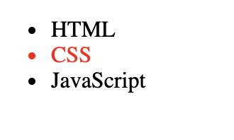

# DOM

* 웹페이지를 자바스크립트로 제어하기 위한 객체 모델 
* window 객체가 창을 의미한다면 document 객체는 윈도우에 로드된 문서를 의미한다.

## 제어 대상을 찾기

* 문서(웹페이지)를 자바스크립트로 제어하려면 제어의 대상에 해당되는 객체를 찾아야 한다. document 객체의 메소드를 이용한다. 
* 브라우저는 각각의 태그에 대한 객체 또한 만들어 낸다. 해당 객체를 찾아야 한다.
* 변경하고자 하는 element를 의미하는 개체를 조회해야 한다. 

### document.getElementsByTagName

* 태그의 이름을 통해서 가져오는 메서드
* 태그명에 해당하는 객체를 찾아서 리스트를 NodeList라는 유사 배열에 담아 반환한다. 

#### li element의 태그
~~~
<!DOCTYPE html>
<html>
<body>
<ul>
    <li>HTML</li>
    <li>CSS</li>
    <li>JavaScript</li>
</ul>

</body>
</html>
~~~

#### ul의 하위 li 태그
~~~
<!DOCTYPE html>
<html>
<body>
<ul>
    <li>HTML</li>
    <li>CSS</li>
    <li>JavaScript</li>
</ul>
<ol>
    <li>HTML</li>
    <li>CSS</li>
    <li>JavaScript</li>
</ol>

</body>
</html>
~~~

### document.getElementsByClassName

* class 속성의 값을 기준으로 객체 조회
* html에서는 class 자바스크립트에서는 classname으로 부른다. 

~~~
<!DOCTYPE html>
<html>
<body>
<ul>
    <li>HTML</li>
    <li class="active">CSS</li>
    <li class="active">JavaScript</li>
</ul>

</body>
</html>
~~~

### document.getElementByid

* id 값을 기준으로 객체를 조회
* 성능면에서 가장 우수한다. 

~~~
<!DOCTYPE html>
<html>
<body>
<ul>
    <li>HTML</li>
    <li id="active">CSS</li>
    <li>JavaScript</li>
</ul>

</body>
</html>
~~~

### querySelector
* css 선택자의 문법을 이용해서 객체 조회
* queryselector는 하나의 element만 리턴한다. 제일 먼저 나타나는 것!  
* 반환값이 배열 형태가 아니다. 

~~~
<!DOCTYPE html>
<html>
<body>
<ul>
    <li>HTML</li>
    <li>CSS</li>
    <li>JavaScript</li>
</ul>
<ol>
    <li>HTML</li>
    <li class="active">CSS</li>
    <li>JavaScript</li>
</ol>
 

</body>
</html>
~~~

### querySelectorAll
* queryselectoryall는 모든 element를 리턴한다.

~~~
<!DOCTYPE html>
<html>
<body>
<ul>
    <li>HTML</li>
    <li>CSS</li>
    <li>JavaScript</li>
</ul>
<ol>
    <li>HTML</li>
    <li class="active">CSS</li>
    <li>JavaScript</li>
</ol>
 

</body>
</html>
~~~

---

## jQuery 

* 라이브러리는 자주 사용하는 로직을 재사용할 수 있도록 고안된 소프트웨어 
* DOM을 내부에 감추고 보다 쉽게 웹페이지를 조작할 수 있도록 돕는 도구 

## jQuery 사용

* jQeury를 사용하기 위해 html로 jqeury를 로드해야 한다. 

### jQuery 로드하는 방법 

* jquery 코드를 담고 있는 파일을 자신의 웹 페이지에 로드 시켜야 한다. 
* `jquery`에서 CDN(contents delivery network) 가장 가까운 곳에 위치한 파일을 받는 방법

~~~
<!DOCTYPE html>
<html>
<body>

    
</body>
</html>
~~~

* jquery를 통해서 코딩할 내용을 다음 부분에 작성한다.
~~~

~~~

* body 태그를 선택한다.
* prepend 명령문을 통해서 body 태그 아래에 뒤의 명령을 추가한다.
~~~
$('body').prepend('<h1>Hello world</h1>');
~~~

## 제어 대상을 찾기 (jQuery)

* jQuery를 이용하면 DOM을 사용하는 것 보다 효율적으로 필요한 객체를 조회할 수 있다. jQuery는 객체를 조회할 때 CSS 선택자를 이용하다. 

### jQuery의 기본 문법(함수와 객체)

* 항상 `$`로 시작된다. `$()`는 jQuery의 함수이다. 
* 일반적으로 인자값으로는 CSS 선택자가 들어온다. 
* jQuery 객체를 리턴하며 이 객체는 선택자에 해당하는 엘리먼트를 제어하는 다양한 메소드를 가지고 있다. 
* css 메서드는 스타일 값의 color를 red로 바꾼다. (<li> -> <li style="color:red">)

~~~
$('li').css('color', 'red')
~~~

### 사용 예제

기존의 자바스크립트로 작성한 여러 줄의 DOM 코드를 jQuery를 사용하면 한 줄로 가능해 진다. 반복문을 내부적으로 동작하기 때문에 반복문을 사용하지 않아도 된다. 

~~~
// 태그명
$('li').css('color', 'red')     

// 클래스 명
$('.active').css('color', 'red')

// 아이디 명
$('$active').css('color', 'red').css('textDecoration', 'underline');
~~~

#### 체이닝

* 선택한 elements 들에 대해서 연속적으로 메소드를 호출해서 작업을 하는 것

~~~
// 첫번째 css 메서드의 리턴값을 그 다음 css 메서드가 받아 적용시킨다. 즉 색이 붉은색으로 변경된 단어 밑에 밑줄이 생긴다. 체이닝!!
$('$active').css('color', 'red').css('textDecoration', 'underline');
~~~

