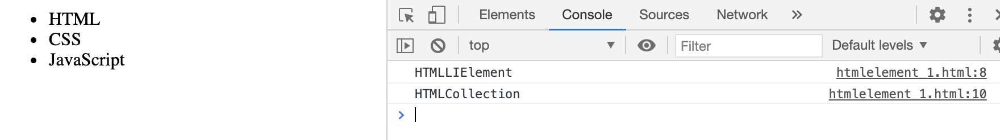
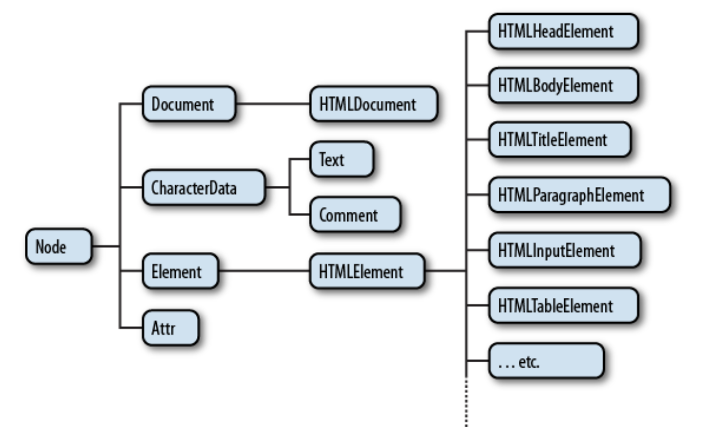
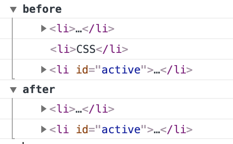

# HTML Element

각각의 태그들이 즉 element들이 어떤 객체를 가지고 있는지

getElement* 메소드를 통해서 원하는 객체를 조회했다면 이 객체들을 대상으로 구체적인 작업을 처리해야 한다. 이를 위해서는 획득한 객체가 무엇인지 알아야 한다. 그래야 적절한 메소드나 프로퍼티를 사용할 수 있다.

getElement* 메소드를 통해서는 HTMLElement 객체를 얻게 되다. 이 객체의 프로퍼티를 통해서 해당 태그의 속성 값들을 변경시킬 수 있다. 

~~~
<ul>
    <li>HTML</li>
    <li>CSS</li>
    <li id="active">JavaScript</li>
</ul>

~~~

단수형 객체는 HTMLLIElement이며 복수형 객체는 HTMLCollection 객체로 반환한다. 이때 HTMLLIElement에서 중간에 LI는 li 리스트 태그이기 때문이다. 

HTMLCollection은 유사배열이라고도 하며 여러개의 Element들을 담고 있다. 
~~~
getElement~ -> HTMLLIElement
getElements~ -> HTMLCollection 
~~~

---

## 객체마다 다른 속성을 제공

Element에 따라 해당되는 객체가 다르며 해당 객체에 따라 제공되는 기능이 다르다. 

~~~
<a id="anchor" href="http://opentutorials.org">opentutorials</a>
<ul>
    <li>HTML</li>
    <li>CSS</li>
    <li id="list">JavaScript</li>
</ul>
<input type="button" id="button" value="button" />

~~~

~~~
// HTML LI Element
console.log(target.constructor.name);

// HTML Anchor Element
console.log(target.constructor.name);

// HTML Input Element
console.log(target.constructor.name);
~~~

각각의 Elemet를 제어하기 위한 객체가 다르다. 이는 즉슨 사용할 수 있는 프로퍼티 즉 기능이 달라진다. 목록 태그인 li 태그는 다른 두 태그와 다르다. 결과적으로 a, li, input 태그들은 모두 HTMLElement라는 공통적인 특성을 가지고 있어서 공통적인 사용성을 가지고 있으면서 동시에 각각의 쓰임에 따라서 기능이 달라진다. 기능을 달리 하기 위해서 각각의 Element 들이 다른 객체를 가지고 있는 것이다. 

리스트의 경우 type 으로 squre 모양으로 변경해주는 기능이 있지만 a 태그 같은 경우는 해당 기능이 필요없으므로 존재하지 않는다. 
~~~
var target = document.getElementById('list');
target.type "squre"
~~~

### HTMLElement를 상속 받는다.

* 둘 다 부모 객체가 HTMLElement로 같기 때문에 부모의 속성 값을 그대로 사용할 수 있다. 

~~~
interface HTMLLIElement : HTMLElement {
           attribute DOMString       type;
           attribute long            value;
};

interface HTMLAnchorElement : HTMLElement {
           attribute DOMString       accessKey;
           attribute DOMString       charset;
           attribute DOMString       coords;
           attribute DOMString       href;
           attribute DOMString       hreflang;
           attribute DOMString       name;
           attribute DOMString       rel;
           attribute DOMString       rev;
           attribute DOMString       shape;
           attribute long            tabIndex;
           attribute DOMString       target;
           attribute DOMString       type;
  void               blur();
  void               focus();
};
~~~

## DOM Tree

모든 엘리먼트는 HTMLElement의 자식이다. 따라서 HTMlElement의 프로퍼티를 똑같이 가지고 있다. 동시에 엘리먼트의 성격에 따라서 자신만의 프로퍼티를 가지고 있는데 이것은 엘리먼트의 성격에 따라서 달라진다.
HTMLElement는 Element의 자식이고 Element는 Node의 자식이다. Node는 Object의 자식이다. 이러한 관계를 DOM Tree라고 한다.

출처: <https://web.stanford.edu/class/cs98si/slides/the-document-object-model.html>

---

# HTML Collection 객체

* 리턴 결과가 복수인 경우에 사용하게 되는 객체이다. 유사배열로 배열과 비슷한 사용방법을 가지고 있지만 배열은 아니다. 
* 목록이 실시간으로 변한다. 
* HTML Collection은 제거되는 순간 반영된다. 

~~~
<!DOCTYPE html>
<html>
<body>
<ul>
    <li>HTML</li>
    <li>CSS</li>
    <li id="active">JavaScript</li>
</ul>

</body>
</html>
~~~

* 일련의 로그들이 그루핑돼서 보여진다.
~~~
console.group('before')
~
console.groupEnd();

console.group('after')
~
console.groupEnd();
~~~

