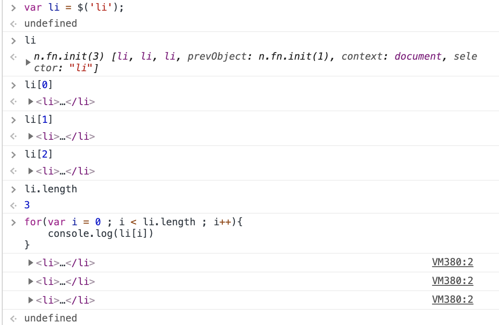
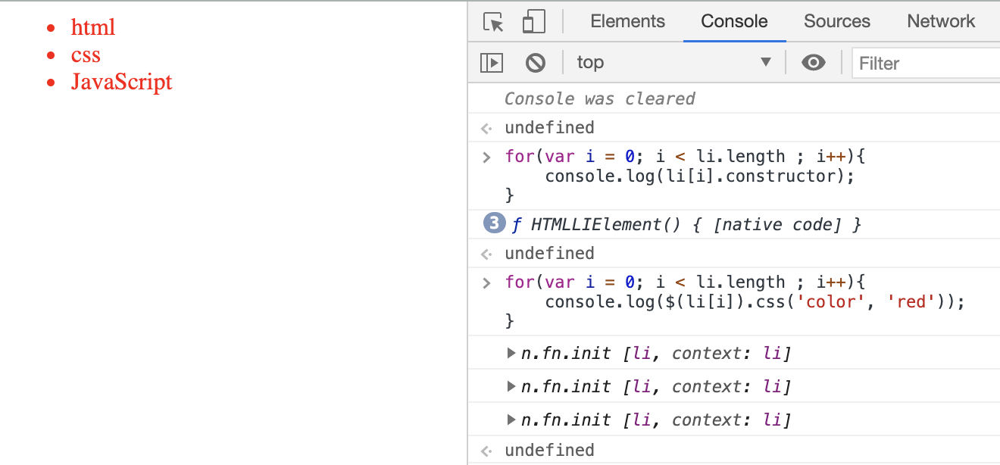
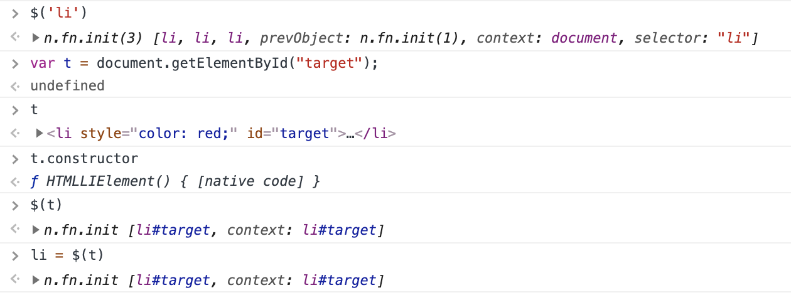

# JQuery 객체

* jQuery 객체는 jQuery 함수의 리턴값으로 jQuery 함수를 이용해 선택한 엘리먼트들에 대해서 처리할 작업을 프로퍼티로 가지고 있는 개체다. 객체이기 때문에 속성값과 메서드를 가지고 있다. 

* 암시적인 반복은 jQeury 객체의 가장 중요한 특성이다. DOM과는 달리 jQuery 객체의 메소드를 실행하면 선택된 엘리먼트 전체에 대해서 동시에 작업이 처리된다. 내부적으로 실행하기 때문에 실제로 작성되는 코드는 짧다. 

## 메서드 사용
* 두 개의 인자를 주면 설정을 하게되고 하나의 인자를 주면 값을 가져오게 된다.
* 값을 설정할 때는 암시적 반복으로 모두 적용된다.
* 값을 가져올 때는 선택된 엘리먼트 중 첫번째에 대한 값만을 반환한다. 
~~~
var li = $('li');
li  // jQuery Object

li.css('test-decoration', 'underline');  // 두 개의 인자를 작성하면 설정을 하게 된다.

li.css('test-decoration')  // 하나의 인자를 작성하면 값을 가져온다. 
~~~

---

## 조회 결과 -> jQuery 객체에 담겨있는 요소를 조회하는 것!

* jQuery 객체에는 조회된 엘리먼트가 담겨있다.
* jQuery 객체는 일종의 유사배열의 형태로 조회된 엘리먼트를 가지고 있으며 배열처럼 사용이 가능하다. 
* jQuery 객체에서 length 메서드를 통해 담고 있는 엘리먼트 개수를 계산할 수 있다. 

~~~
<ul>
    <li>html</li>
    <li>css</li>
    <li>JavaScript</li>
</ul>

~~~

* jQuery 객체에 담겨있는 객체는 DOM 객체로 htmlelement 객체이다 .
~~~
var li = $('li');  
li // jQuery 객체

li[0]  //<li>html</li>
li[1]  //<li>css</li>
li[2]  //<li>javascript</li>

for(var i = 0; i<li.length; i++){
    console.log(li[i])
}
// 결과 -> <li>html</li> \n <li>css</li> \n <li>javascript</li>

// jQury 객체의 각각의 요소에 접근
for(var i = 0; i<li.length; i++){
    console.log(li[i].constructor)
}
// 결과 -> function HTMLElement() {[native code]}

// jQuery 메서드는 DOM 객체가 가지고 있지 않기 때문에 오류 발생한다.!
for(var i = 0; i<li.length; i++){
    console.log(li[i].constructor)
}

// jQuery 함수로 감싸준다. 즉 html element 객체 요소로 접근 후 jQuery 객체의 메서드를 사용하기 위해서는 jQuery 함수를 이용한다.
for(var i = 0; i<li.length; i++){
    console.log($(li[i]).constructor)
}

~~~

### 실습

* css 선택자를 jQuery 인자로 전달하면 해당 element 를 선택할 수 있게 된다. 
* DOM 객체를 jQury 인자로 전달하면 해당 element를 선택할 수 있게 된다. 
* 그렇다면 차이는 컴마를 주는 유무인가

~~~
$('<css selector>'): css 선택자를 통해 jQuery 객체 생성
$(<dom 객체>) : DOM 객체에서 jQuery 메서드를 사용하기 위해 jQuery 메서드로 만든다. !
~~~

## map

* jQuery 객체 메서드 중 하나로 객체의 element를 조회할 때 사용된다. 
* 선택한 element 모두를 순회하면서 인자로 전달한 함수를 모두 호출한다.
* 모든 element 요소에 접근하면서 차례대로 함수를 모두 호출한다.
* function() 함수가 호출된다. 
* 함수의 첫번째 파라미터 index는 element에 대한 인덱스 값이며 두번째 파라미터 elem은 해당 DOM 객체를 의미한다. 

~~~
<ul>
    <li>html</li>
    <li>css</li>
    <li>JavaScript</li>
</ul>

~~~

## jQuery 객체 api

* jQuery 객체를 제어할 수 있는 메서드, 프로퍼티의 리스트