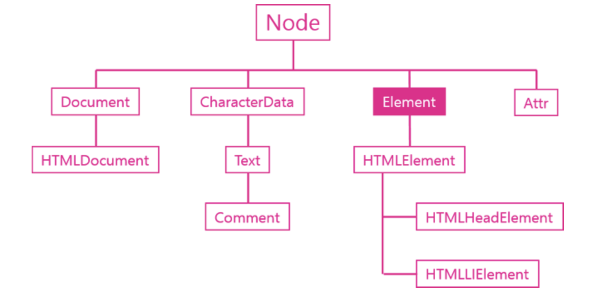
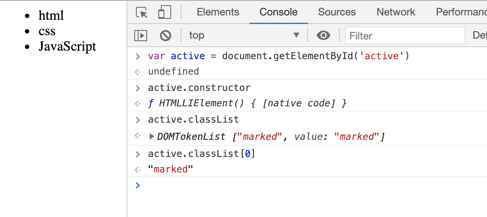
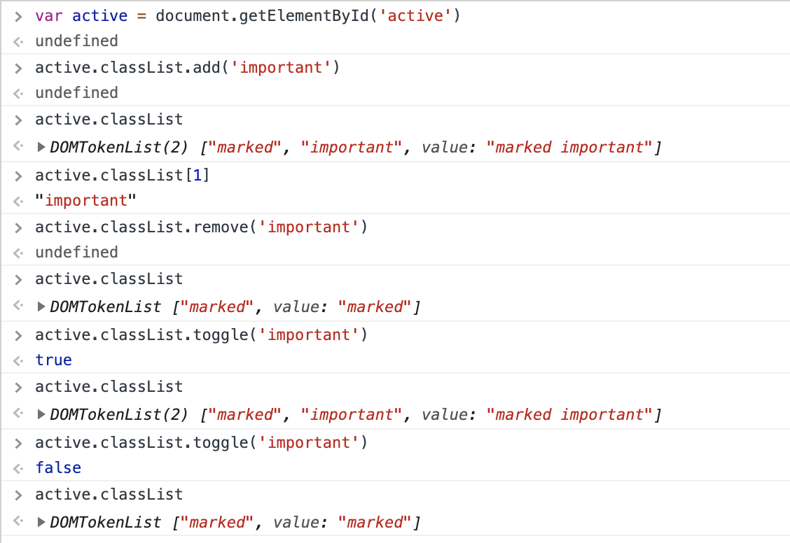
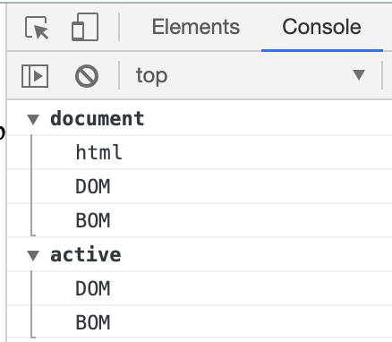

# ELEMENT 객체

## DOM
* 마크업 규격이며 HTML, XML, SVG, XUL 등의 마크업 언어들을 모두 제어 하기 위한 규격이라고 볼 수 있다.
* 따라서 HTML 만 제어할 수 있는 것이 아니다. 그리고 자바스크립트 뿐만아니라 다른 프로그래밍 언어에서 DOM을 지원하면 마크업 언어들을 제어할 수 있는 것이다.

## ELEMENT 객체

* 문서상의 각각의 element(tag)를 추상화 한 것이다. 

### 다른 객체들과의 관계

출처: 생활코딩

### ELEMENT와 HTMLELEMENT 객체를 분화한 이유

html의 element 만을 위한 기능을 추가하기 위해서 이다. 

## ELEMENT API

* element 객체가 제공하는 기능(api)

### 식별자 api

* Element.classList
* Element.className
* Element.id
* Element.tagName

### 조회 api
* Element.getElementsbyClassName
* Element.getElementsByTagname
* Element.querySelector
* Elemetn.querySelectorAll

### 속성 api
* Element.getAttribute(name)
* Element.setAttribute(name, value)
* Element.hasAttribute(name)
* Element.removeAttribute(name)

---

# 식별자 API

> Element 객체가 가지고 있는 식별자를 가져올 수 있는 api

* 식별자를 가져온다.
* 식별자를 변경한다.

~~~
<ul>
    <li>html</li>
    <li>css</li>
    <li id="active" class="important current">JavaScript</li>
</ul>

~~~

* `document.getElementById('active')` 는 HTMLLIELEMENT이며 HTMLELEMENT와 그리고 ELEMENT 를 상속받아 ELEMENT의 메서드를 사용할 수 있다. 
* ELEMENT의 `tagName`은 태그 명을 읽어오는 메서드이며 읽기전용으로 값을 변경할 수는 없다. 

### HTML에서 식별자로 사용되는 요소들
* element 이름
* id
* class 

## Element.tagName

* element의 id element의 프로퍼티이며 값을 조회할 수 있다. 

## Element.id

* element의 id는 element의 프로퍼티이며 값을 조회하고 변경할 수 있다.

~~~
<ul>
    <li>html</li>
    <li>css</li>
    <li id="active">JavaScript</li>
</ul>

~~~

## Element.className

* Element의 클래스 이름을 조회, 변경 가능한 api 이다. 

~~~
<ul>
    <li>html</li>
    <li>css</li>
    <li id="active">JavaScript</li>
</ul>

~~~

## Element.classList

* (HTMLElement)Element에 사용하면 `DOMTokenList 객체` 반환

~~~
var active = document.getElementById('active')  //active는 HTMLElement 객체이다.

active.classlist  // DOMTokenList이다. 
~~~

~~~
active.classList.add('important')  //클리스명 추가

active.classList.remove('important')  //클래스명 제거

active.classList.toggle('important')  // 존재하면 삭제 없으면 추가
~~~

### DOMTokenList

* classList 메서드 사용시 반환되는 객체이며 클래스의 이름을 담고 있다.
* 유사배열이기 때문에 배열처럼 사용할 수 있다. 

~~~
add('<class명>')  //클래스명 추가 
remove('<class명>')  //클래스명 제거 
toggle('<class명>')  // 클래스명 존재시 제거 없으면 추가
~~~

---

# 조회 api

## document.getElementBy* 메소드
* document 객체는 문서 전체를 의미하는 객체이다.
* 문서 전체를 대상으로 element를 찾게 된다.

## element.getElementBy* 메소드
* document가 아닌 특정 element로 조회를 하기 때문에 범위를 주르일 수 있다. 
* 어떤 객체의 하위 객체에서 찾을 때 유용하다.

~~~
<ul>
    <li class="marked">html</li>
    <li>css</li>
    <li id="active">JavaScript
        <ul>
            <li>JavaScript Core</li>
            <li class="marked">DOM</li>
            <li class="marked">BOM</li>
        </ul>
    </li>
</ul>

~~~

## 속성 api

속성이란 태그의 이름만으로 정보를 나타내기 어려울 때 부가적으로 작성하는 기능들이다. 정보들에 대한 부가적인 정보 표시 attribute

속성을 제어하는 api
* Element.getAttribute(name) -> element.id == element.getAttribute('id')
* Element.setAtribute(name, value): 기존 속성값을 바꾸거나 새로운 속성값을 추가할 수 있다. 
* Element.hasAttribute(name): 속성의 존재 여부를 확인한다. 
* Element.removeAttribute(name): 기존 속성을 삭제하는 방법 

~~~
<a id="target" href="http://opentutorials.org">opentutorials</a>

~~~

### atribute(속성) vs property

~~~

    Hello world

~~~

#### 속성 방법 -> element의 메서드를 사용하여 속상값을 바꾸는 방법
target element의 setAttibute를 통해서 class 값을 important로 지정하는 방식을 속성 방식

#### property 방법 -> element의 property 자체에 접근하여 속성값을 바꾸는 방법
target의 프로퍼티중에 className을 직접 지정하는 방식을 property 방식이다. 
더 칸편하고 속도가 빠르다. 하지만 