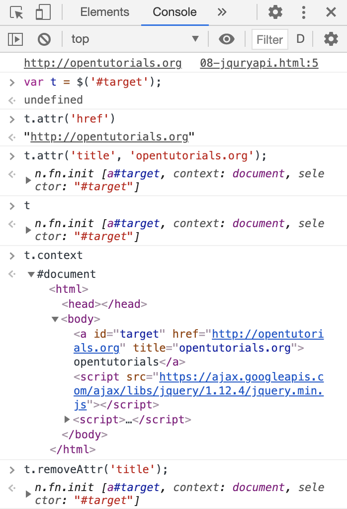

# jQuery 속성 제어 API

* element api기능과 비슷한 jquery의 api
~~~
element <- htmlelement <- html~element
~~~

* setAttribute, getAttribute 대응되는 메서드는 `attr`이다.
* removeAttribute에 대응되는 메소드는 `removeAttr`이다.

~~~
<a id="target" href="http://opentutorials.org">opentutorials</a>

~~~

---

# attribute와 property 

* attr은 attribute 방식이다. 태그 속성값에 작성된 그대로 받아들인다. 

* prop은 property 방식이다. 적용된 값이 반환된다.

~~~
<a id="t1" href="./demo.html">opentutorials</a>
<input id="t2" type="checkbox" checked="checked" />

~~~

* jquery를 이용할 시 이름 형태가 동일하다. 
~~~

opentutorials

opentutorials

~~~

---

# jQuery 조회 범위 제한

* 문서의 전체가 아니라 특정 element의 하위 element만 찾는 방법
* element 객체에서 getElementsBy* 메소드를 사용하면 조회의 범위가 해당 객체의 해당 하위 엘리먼트로 제한되었다.

## selector context

* A 선택자를 가진 element 중에서 B를 선택자로 가지고 있는 element 조회 
~~~
$('A','B')
~~~

* id값이 active인 element의 하위 태그의 makred 클래스명을 가진 element 제어
~~~
<ul>
    <li class="marked">html</li>
    <li>css</li>
    <li id="active">JavaScript
        <ul>
            <li>JavaScript Core</li>
            <li class="marked">DOM</li>
            <li class="marked">BOM</li>
        </ul>
    </li>
</ul>

~~~

## .find

* jquery 객체 내에서 element를 조회하는 기능
~~~
$( "#active").find('.marked').css( "background-color", "red" );
~~~

* 체인을 끊지 않고 작업의 대상을 변경할 수 있다. -> find에 앞서 적용된 코드들이 동일하게 적용된다. 
~~~
$('#active').css('color','blue').find('.marked').css( "background-color", "red" );
~~~
