# Node 객체
* DOM의 가장 최상위 객체이다. 모든 DOM의 객체는 Node 객체를 상속받는다. Node의 모든 프로퍼티를 상속받는다. 

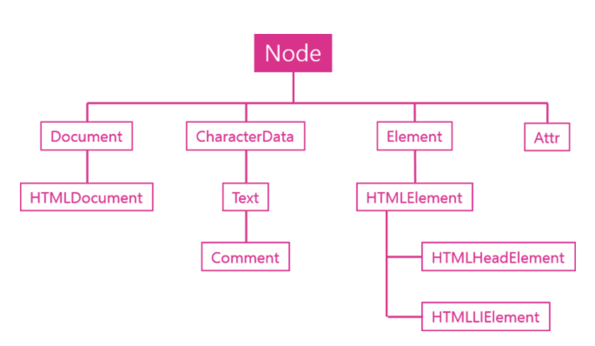
출처: [생활코딩](https://opentutorials.org/course/1375/6698)

## 노드의 관계
각각의 노드 객체에 관계성을 부여하는 api이며 각각의 노드들이 어떤 관계(상속)인지 알아내는 기능을 한다.
* Node.childNodes : 노드 객체의 자식 노드들
* Node.firstChild : 노드 객체의 첫번째 자식 노드
* Node.lastChild : 두번째 자식 노드
* Node.nextSibliing: 같은 상속 레벨에서 다음 노드 객체, 다음 형제
* Node.previousSibling: 같은 상속 레벨에서 이전 노드 객체, 이전 형제 
* Node.contains() 
* Node.hasChildNodes()

## 노드의 종류
* Node.nodeType : 노드 객체가 어떤 카테고리에 속해 있는지
* Node.nodeName : 노드 객체의 이름이 뭔지

## 노드의 값
* Node.nodevalue: 노드 객체가 가지고 있는 값
* Node.textContent: 노드 객체가 가지고 있는 하위 텍스트 값

## 노드의 자식 관리
* Node.appendChild() : 노드 객체를 자식으로 추가
* Node.removeChild() : 노드 객체의 자식을 삭제

---

# Node 관계 API

* Node.childNodes : 자식노드들을 유사배열에 담아서 리턴
* Node.firstChild : 첫번째 자식노드
* Node.lastChild : 두번째 자식노드
* Node.nextSibling : 다음 형제 노드
* Node.preivousSibling : 이전 형제 노드
~~~
<body id="start">
<ul>
    <li><a href="./532">html</a></li> 
    <li><a href="./533">css</a></li>
    <li><a href="./534">JavaScript</a>
        <ul>
            <li><a href="./535">JavaScript Core</a></li>
            <li><a href="./536">DOM</a></li>
            <li><a href="./537">BOM</a></li>
        </ul>
    </li>
</ul>

</body>
~~~

* element 들의 사이에 존재하는 Node 객체이다. 
~~~
#text
~~~

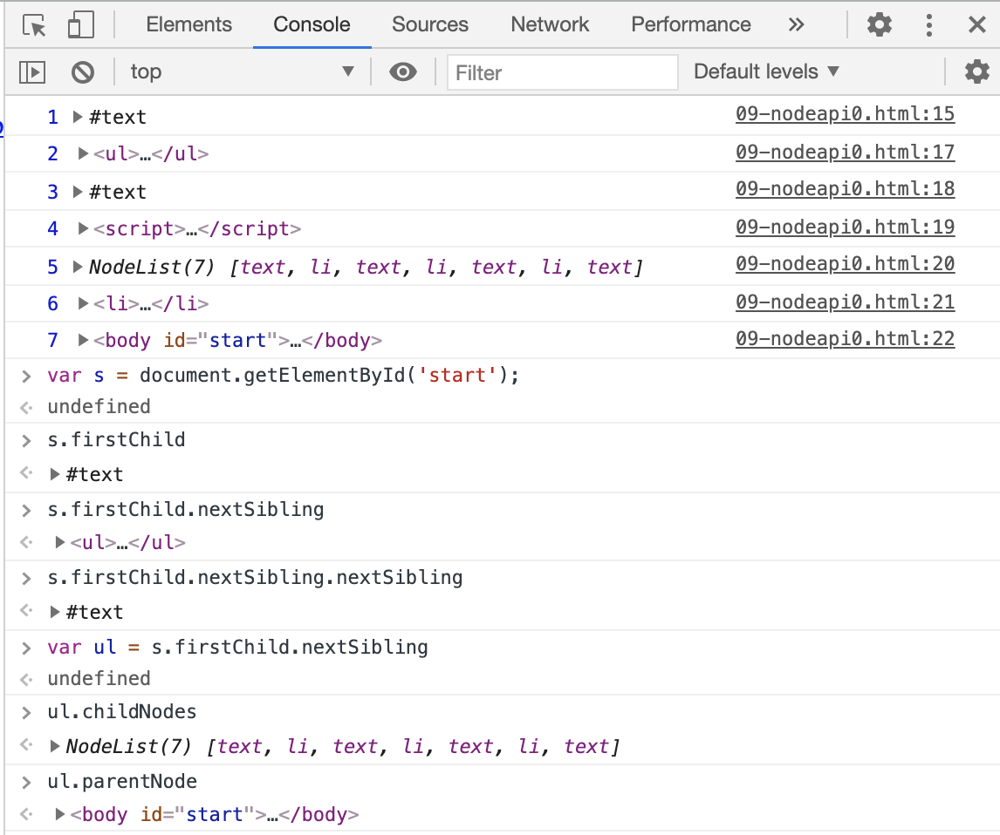

---

# Node 종류 API
현재 선택된 노드가 어떤 타입인지 확인한다. 비교 연산자 사용할 수도 있다.
* Node.nodeType: 노드의 타입을 의미한다.
* Node.nodeName: 노드의 이름(태그명)을 의미한다. 

* 노드의 프로퍼티 출력 -> 상수 형태
~~~
for(var name in Node){
   console.log(name, Node[name]);
}
~~~

* 타입 확인
~~~
var body = document.getElementById('start');

body.nodeType  // 1 -> ELEMENT_NODE

body.firstChild.nodeType // 3 -> TEXT_NODE

document.nodeType  // 9 -> DOCUMENT_NODE
~~~

* 타입 체크
~~~
body.firstChild.nodeType === 3  //true
body.firstChild.nodeType === Node.TEXT_NODE  //true
~~~

* 노드 이름
~~~
body.firstChild.nextSibling.nodeName
~~~

[img34](./img/img34.png)

[img35](./img/img35.png)

## 재귀함수 1
* 특정 element 부터 하위 element들을 찾는 메서드 작성

### travers 함수
* 첫번째 인자: 조회하려는 가장 최상위 root element
* 두번째 인자: 현재 탐색하고 있는 element를 첫번째 인자로 가진 함수
~~~
traverse(document.getElementById('start'), function(elemn){

})

//body 부터 시작해서 element 하나하나를 접근한다.
traverse(document.getElementById('start'), function(elemn){
    console.log(elem);
})

// a 태그만 조회
traverse(document.getElementById('start'), function(elemn){
    if(elem.nodeName === 'A'){
        elem.style.backgroundColor = 'blue';    
    }
})
~~~

#### 파라미터를 함수형태로 작성한다.
* 선언된 함수를 사용할 때 매개변수 작성부에 함수 내용을 정의한다. 
~~~
function traverse(target, callback){
    callback(target);
}

traverse(document.getElementById('start'), function(elem)){
    console.log(elem);
}
~~~

#### 하위 태그로 이동할때는 재귀법이 사용된다.
* 자식노드를 조회한 후 모든 자식 노드를 함수 처리한다.  
~~~
function traverse(target, callback){
    callback(target);
    var c = target.childNodes;
    for(var i=0; i<c.length; i++){
        traverse(c[i], callback);
    }
}

traverse(document.getElementById('start'), function(elem)){
    console.log(elem);
}
~~~

~~~
<!DOCTYPE html>
<html>
<body id="start">
<ul>
    <li><a href="./532">html</a></li> 
    <li><a href="./533">css</a></li>
    <li><a href="./534">JavaScript</a>
        <ul>
            <li><a href="./535">JavaScript Core</a></li>
            <li><a href="./536">DOM</a></li>
            <li><a href="./537">BOM</a></li>
        </ul>
    </li>
</ul>

</body>
</html>
~~~

---

# Node 변경 API

* 노드 추가
* 노드 제거
* 노드 변경

## Node 추가
* appendChild(child): 매개변수로 주어진 엘리먼트를 노드의 마지막 자식 노드로 추가한다. 
* insertBefore(newElement, referenceElement): 방법은 동일하며 두번째 인자를 통해 해당 노드 바로 뒤의 위치에 자식노드로 추가된다. 

### 노드 생성 api
노드를 추가하기 위해서는 추가할 element를 생성해야 하며 이것은 document 객체의 기능이다.
* document.createElement(tagname): element 노드를 추가하다.
* document.createTextNode(data): 텍스트 노드를 추가한다. 

~~~
<ul id="target">
    <li>HTML</li>
    <li>CSS</li>
</ul>
<input type="button" onclick="callAppendChild();" value="appendChild()" />
<input type="button" onclick="callInsertBefore();" value="insertBefore()" />

~~~

* target의 firstChild는 text이다.
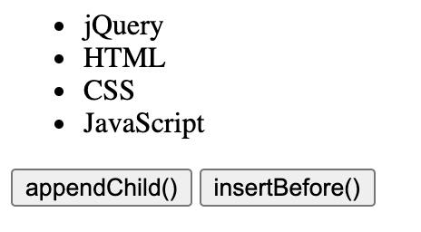

## Node 제거
* removeChild(child): 부모객체로 접근하여 해당 element를 제거해야한다. -> 부모 element 접근시 parentNode를 접근한다.
~~~
target.parentNode.removeChild(target);
~~~

## Node 변경
* replaceChild(newChild, oldChild)
~~~
<ul>
    <li>HTML</li>
    <li>CSS</li>
    <li id="target">JavaScript</li>
</ul>
<input type="button" onclick="callReplaceChild();" value="replaceChild()" />

~~~

---

# JQuery Node 변경 API

## 추가

출처: [생활코딩](https://opentutorials.org/course/1375/6743)

* 지정된 대상의 모든 element에 적용된다. 
* `before`과 `after`은 target의 형제로 삽입된다.
* `prepend`와 `append`는 target의 자식으로 삽입된다.

~~~
//before

//prepend
    content1
//append

//after

 //before

//prepend
    content2
//append

//after 

~~~

## 제거

* remove: 선택된 엘리먼트가 제거된다.
* empty : 선택된 엘리먼트의 text 엘리먼트가 제거된다.

~~~

    target 1

 

    target 2

 
<input type="button" value="remove target 1" id="btn1" />
<input type="button" value="empty target 2" id="btn2" />

~~~

* id가 target1인 엘리먼트 자체는 삭제되어서 존재하지 않으며 id가 target2인 엘리먼트만 존재한다. 이때 target2 엘리먼트에는 텍스트 내용이 제거되었다.

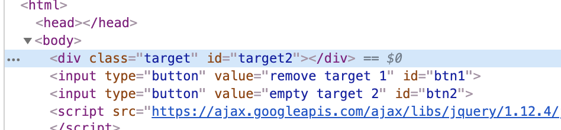

## 바꾸기
* replaceAll: 변경할 것(결과) -> 변경될 것(제어 대상자)
* replaceWith: 변경될 것(제어 대상자) -> 변경할 것(결과)

제어 대상과 바꾸고자 하는 것의 위치 

~~~

    target 1

 

    target 2

 
<input type="button" value="replaceAll target 1" id="btn1" />
<input type="button" value="replaceWith target 2" id="btn2" />

~~~

## 복사

* 노드를 복사한다.
* 복사하여 똑같은 것이 만들어진다.

~~~

    target 1

 

    target 2

 

source

 
<input type="button" value="clone replaceAll target 1" id="btn1" />
<input type="button" value="clone replaceWith target 2" id="btn2" />

~~~

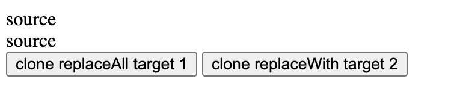

## 이동
* 노드 이동 -> 노드 단순 추가하는 기능이다.

~~~

    target 1

 

source

 
<input type="button" value="append source to target 1" id="btn1" />

~~~

---

# 문자열로 노드 제어

기존의 노드 api를 사용하여 제어하던 복잡한 방식을 편리하게 해주는 방법들이다. 조회 후 변경할 때 문자열 형태로 인자를 전달하면 해당 문자대로 코드를 적용시켜준다.
* innerHTML
* outerHTML
* innerText, outerText
* insertAdjacentHTML()

## innerHTML
* 엘리먼트의 하위 엘리먼트 코드를 조회할 수 있으며 값을 변경할 수도 있다.
~~~
<ul id="target">
    <li>HTML</li>
    <li>CSS</li>
</ul>
<input type="button" onclick="get();" value="get" />
<input type="button" onclick="set();" value="set" />

~~~

* 기존 화면
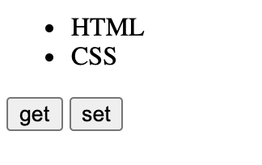

* get click -> 하위태그의 엘리먼트 표시
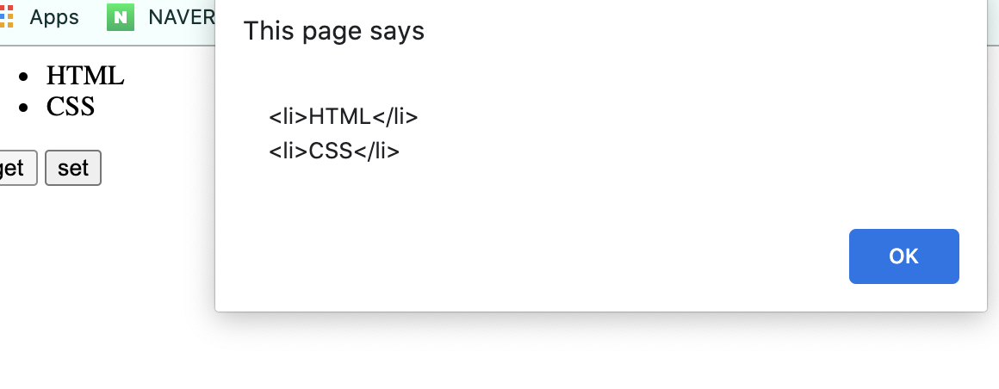

* set click -> 하위태그 내용을 변경
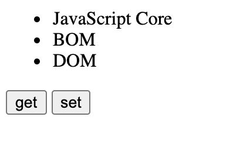

## outerHTML
* 자시자신을 포함한 전체 엘리먼트 조회 및 변경 가능
~~~
<ul id="target">
    <li>HTML</li>
    <li>CSS</li>
</ul>
<input type="button" onclick="get();" value="get" />
<input type="button" onclick="set();" value="set" />

~~~

* 기존 화면
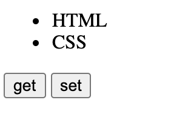

* get click -> 자신을 포함한 전체 엘리먼트 표시
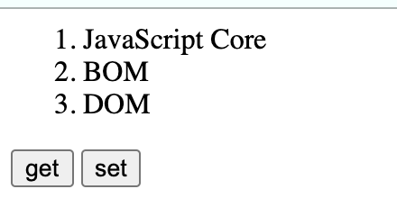

* set click -> 자신을 포함한 전체 엘리먼트 값 변경
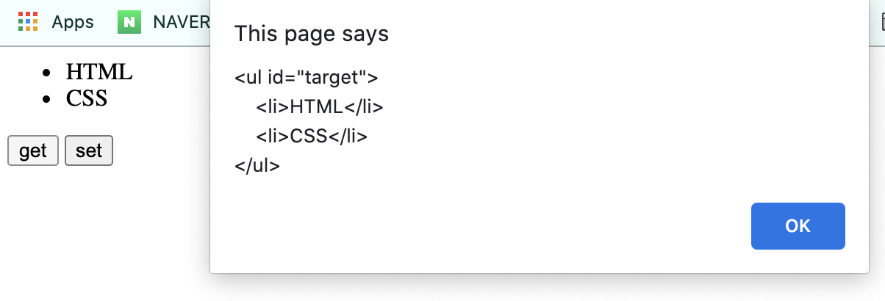

## innerText, outerText

* 읽기를 하게되면 태그가 제외된 상태로 읽기가 되고
쓰기를 하게 되면 그 태그에 해당되는 내용이 문서에 반영되지않고 태그 내용 그대로 문서에 출력된다.

~~~
<ul id="target">
    <li>HTML</li>
    <li>CSS</li>
</ul>
<input type="button" onclick="get();" value="get" />
<input type="button" onclick="set();" value="set" />

~~~

* 기존 화면
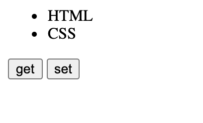

* get click -> 태그가 제외된 상태로 출력
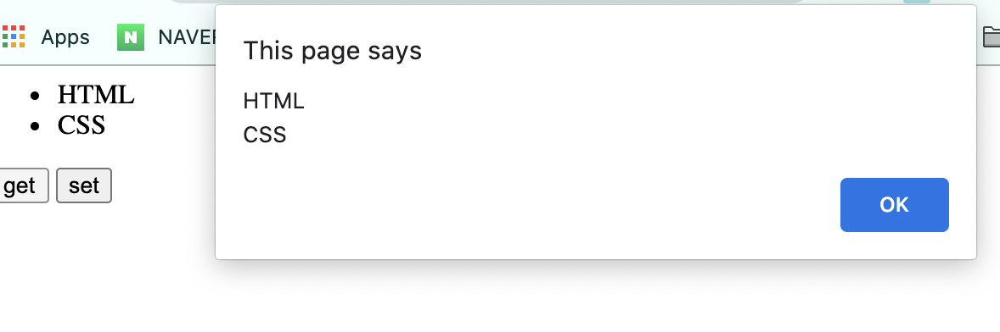

* set click -> 반영되지 않고 그대로 출력
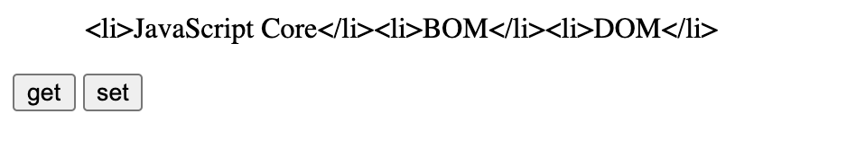

## insertAdjacentHTMl()

* 첫번째 인자로 4가지가 올 수 있다. `beforebegin`, `afterbegin`, `beforeend`, `afterend` 각각 `before`, `after`, `prepend`, `append`와 위치가 동일하다. 
* begin으로 끝나는 인자들은 시작되기 전을 의미하므로 해당 태그 바깥을 의미하며 end로 끝나는 인자들은 끝나기 전을 의미하므로 태그 아쪽을 의미한다. 
* 두번째 인자로 html 코드를 전달한다. 

~~~
<ul id="target">
    <li>CSS</li>
</ul>
<input type="button" onclick="beforebegin();" value="beforebegin" />
<input type="button" onclick="afterbegin();" value="afterbegin" />
<input type="button" onclick="beforeend();" value="beforeend" />
<input type="button" onclick="afterend();" value="afterend" />

~~~

* 버튼을 전부 click할 시

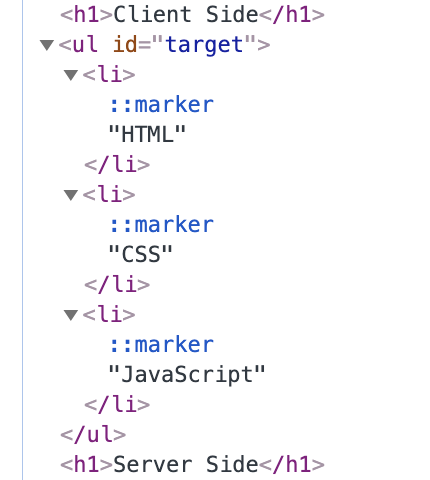