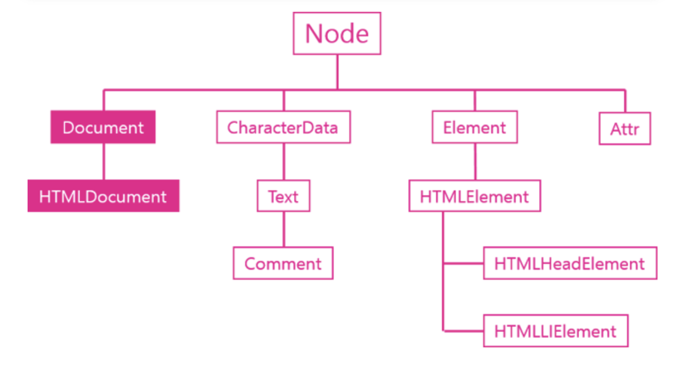
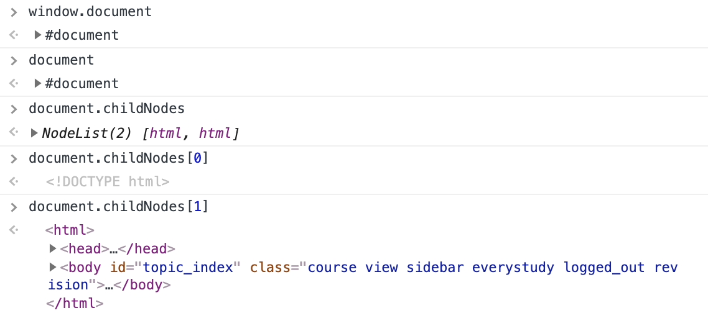

# Document 객체

* 문서 전체를 의미하는 노드이며 객체이다.
* DOM의 시작점 그리고 규격 인터페이스라고 할 수 있다. DOM 자체가 문서를 다루는 객체이므로 그 규격이라고 볼 수 있다.

* htmldocument 객체를 통해 html 문서를 document 형식으로 처리할 수 있다. document가 직접 사용되는 것은 아니다.
* htmldocument는 html 문서 전체를 대표하는 객체이면서 전체를 대표하는 노드이다.

* document 객체는 첫번째 자식 노드로   `Docktype html`을 두번째 자식 노드로 `html 전체`로 구성된다. -> 문서 자체라고 볼 수 있다. 
~~~
window.document;
document;

document.childNodes
document.childNodes[0];  //<!DOCTYPE html> 
document.childNodes[1];  // html 문서 전체를 의미한다. 
~~~

출처: [생활코딩](https://opentutorials.org/course/1375/6740)

## 노드 생성 API
새로운 노드를 생성해주는 역할을 한다.
* createElement()
* createTextNode()

~~~
var li = document.createElement('li');

li  //<li></li>
~~~

## 문서 정보 API
문서 정보를 제공한다.
* title
* URL
* referrer
* lastModified

~~~
document.title  // <title> 태그의 텍스트 내용 조회한다.

document
~~~