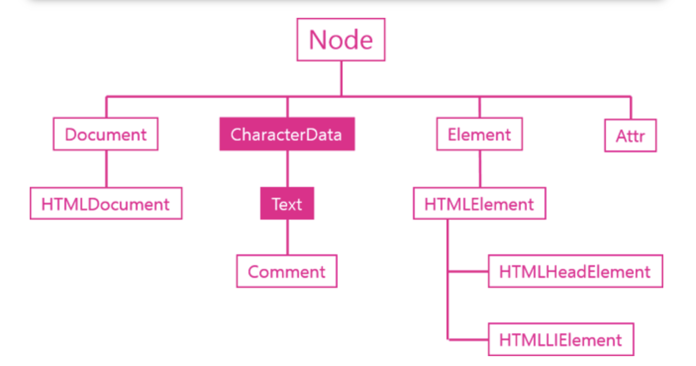
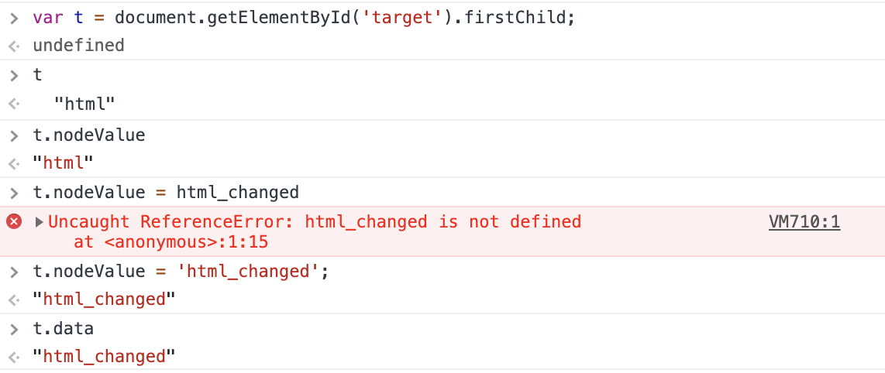
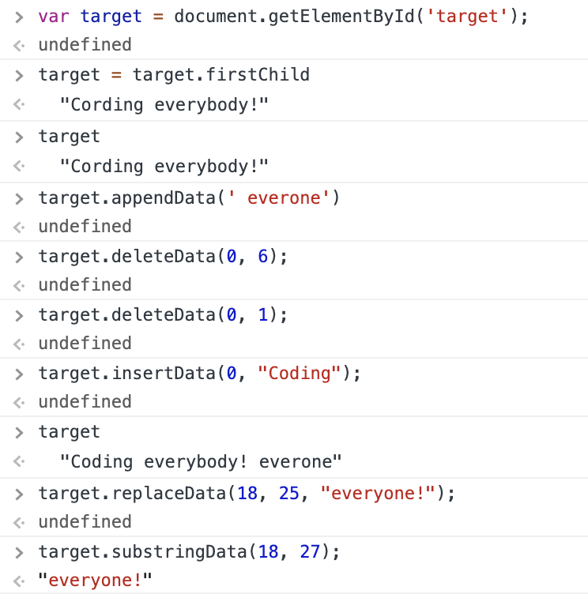

# Text 객체
* 텍스트 정보를 프로그래밍적으로 제어할 수 있는 객체이다.
* `Document`, `Element` 두 다 아닌 객체이다. 
* `CharacterData`의 기능을 상속받는 객체이다. 이때 CharacterData는 문서상에 드러나지 않으면 텍스트 노드 값을 조작할 수 있는 기능들을 제공한다. 
* 텍스트 노드는 DOM에서 실질적인 데이터가 저장되는 객체이다. 

~~~

생활코딩

-> 

 부분은 Element이다. 이 속에 포함된 텍스트부분인 Text 객체이다. 
~~~

출처: [생활코딩](https://opentutorials.org/course/1375/6744)

## DOM 에서의 공백
DOM에서는 공백도 객체에 매핑되어 있다. 

~~~

Hello world
  // p 태그와 span 태그 사이의 공백 존재하지 않음

  // p 태그와 span 태그 사이의 공백 존재한다. 
    Hello world

~~~

~~~
// p 태그 -> span 태그 -> text ("Hello world")
var t1 = document.getElementById('target1');
t1  //
...

t1.firstChild  //Hello world
t1.firstChild.firstChild  //"Hello world"

// p 태그 -> text element(공백에 해당되는 텍스트 element) -> span 태그 -> text ("Hello world")
var t2 = document.getElementById('target2');
t2  //
...

~~~

## Text 객체 API

### 값
* data
* nodeValue

### 조작
* appendData()
* deleteData()
* insertData()
* replaceData()
* subStringData()

### 생성
* document.createTextNode()

---

## 값 API
텍스트 노드는 DOM에서 실질적인 데이터가 저장되는 객체이므로 텍스트 노드는 값과 관련된 여러 기능들을 제공한다. 값을 알아오는 메서드는 다음과 같다.

* nodeValue : 값을 읽어오며 변경 또한 가능하다.
* data : 값을 읽어온다. 

~~~
<ul>
    <li id="target">html</li> 
    <li>css</li>
    <li>JavaScript</li>
</ul>

~~~

## 조작 API

택스트 노드가 상속 받은 `CharacterData` 객체는 다음과 같은 API를 제공한다.
* appendData()
* deleteData()
* insertData()
* replaceData()
* substringData(): 일부의 정보를 가공하는 기능, 일부 정보를 반환한다.

~~~
<!DOCTYPE html>
<html>
<head>
    
</head>
<body>

Cording everybody!

 data : <input type="text" id="datasource" value="JavaScript" />

   start :<input type="text" id="start" value="5" />

 end : <input type="text" id="end" value="5" />

<input type="button" value="appendData(data)" onclick="callAppendData()" />
<input type="button" value="deleteData(start,end)" onclick="callDeleteData()" />
<input type="button" value="insertData(start,data)" onclick="callInsertData()" />
<input type="button" value="replaceData(start,end,data)" onclick="callReplaceData()" />
<input type="button" value="substringData(start,end)" onclick="callSubstringData()" />

</body>
</html>
~~~

