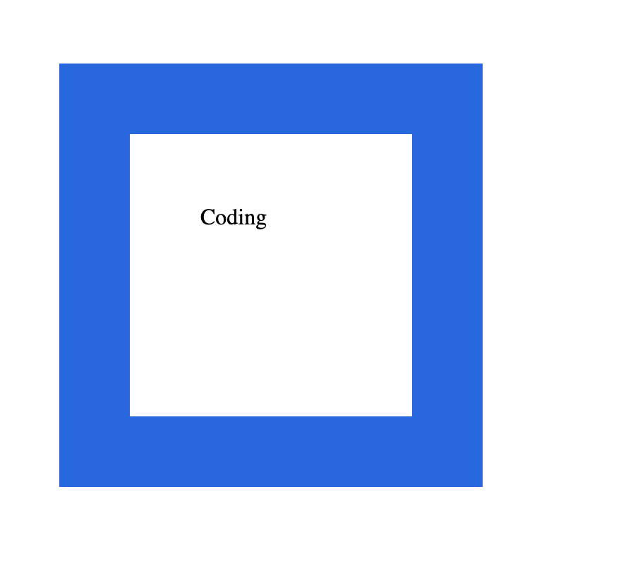
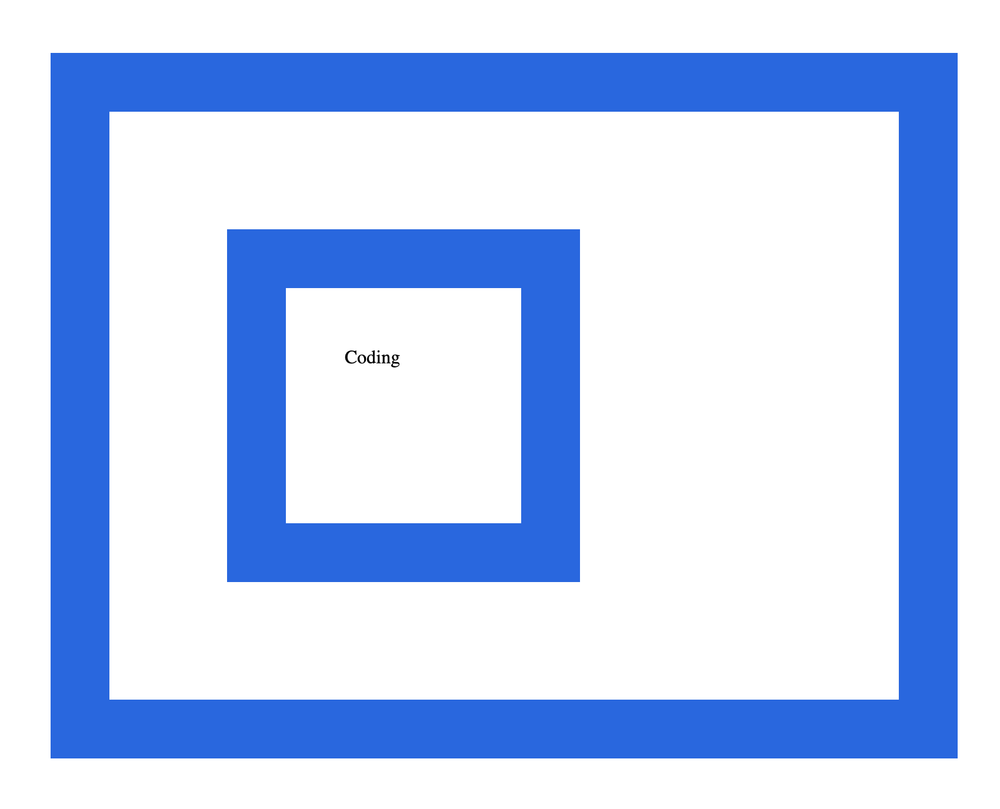
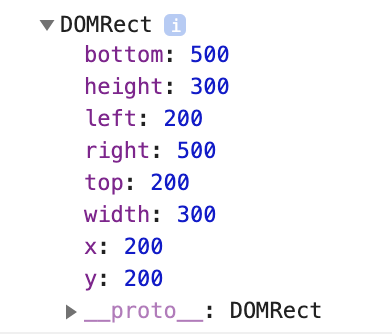

# 문서의 기하학적 특성

## 문서의 기하학적 값 -> 요소의 위치
* top
* right
* left
* bottom
* height
* width

## 박스 모델
border(테두리)를 기준으로 보자!
* border
* padding : content~border
* margin : border ~ border 

## 엘리먼트의 위치와 크기를 알아내기
* 엘리먼트(테두리) 의 위치 50px, 50px
* 엘리먼트의 폭, 가로 길이 300px
* 엘리먼트의 세로 길이  300px
* width는 엘리먼트에서 margin 값이 제외된 값들이다. 즉 **border-padding-content-padding-border**을 의미한다.

~~~
<가로 그림 설명>
margin - border - padding - content(coding) - padding - border - margin
~~~

* getBoundingClinetRect() 호출
* width, height를 explore에서는 제공하지 않는다. 
~~~

    Coding

~~~

~~~
ClientRect {height: 300, width: 300, left: 50, bottom: 350, right: 350...}

bottem: 350  
height: 300  // 엘리먼트의 세로 길이가 300px
left: 50  // 엘리먼트의 최좌측에서 문서의 시작점과의 거리가 50px
right: 350  //엘리먼트가 끝나는 지점의 부분(오른쪽) 부터 문서가 시작되는 왼쪽부분까지의 거리가 350px 
top: 50  // 엘리먼트가 문서의 최상단으로 부터 50px 위치
width: 300  //엘리먼트의 가로 길이가 300px
~~~

* getBoundingclientRect()는 body와 해당 태그 사이의 어떤 태그가 존재하더라도 해당 태그의 위치를 알려준다. 
* offsetParent는 측정의 기준을 알려준다.
* css position의 값이 static, id, th, table인 엘리먼트가 있다면 이 엘리먼트가 offsetParent가 된다. 

~~~

    

        Coding
    

~~~

* border크기를 제외한 width와 height는 `ClientWidth`와 `ClientHeight`를 사용한다.
~~~

~~~

## Viewport
스크롤을 포함한 영역

브라우저는 문서의 전체 크기를 모두 나타내지 못한다. 따라서 스크롤과 같은 기능을 통해 추가적인 부분을 나타낼 수 있게 해준다. 이대 브라우저가 사용자에게 보여주는 영역을 viewport라고 한다. 따라서 실제의 문서 크기와 viewport의 크기가 다르게 존재한다. 각각 좌표와 크기가 존재한다. 

* setInterval 한수는 인자로 전달된 함수를 1초에 한번씩 호출하게 된다. 두번째 인자를 통해 시간을 지정할 수 있다. 
~~~

~~~