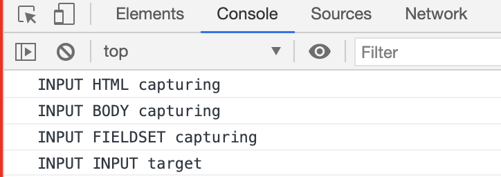
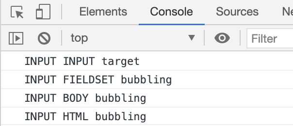
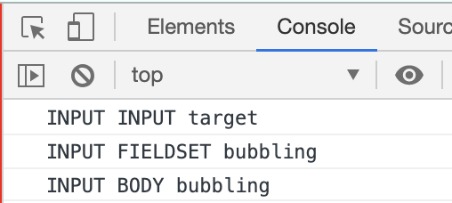

# 이벤트(event)
> 사용자에의해 어떤 일이 발생한 경우를 사건이라고 하며 이것이 곧 이벤트이다. 
* 이벤트는 어떤 사건을 의미한다.
* 브라우저에서의 사건이란 사용자가 클릭했을 '때', 스크롤을 했을 '때', 필드의 내용을 바꾸었을 '때'
* onclick 속성 값으로 js 코드를 등록하면 브라우저는 등록된 js코드를 실행한다. 
* 이벤트 프로그래밍이란 이벤트 별로 처리한 내용을 특정 언어를 통해 등록해 놓은 후 브라우저가 등록된 코드를 실행시키는 것이다. 
~~~
<!DOCTYPE html>
<html>
<body>
    <input type="button" onclick="alert(window.location)" value="alert(window.href)" />
    <input type="button" onclick="window.open('bom.html')" value="window.open('bom.html')" />
</body>
</html>
~~~

사용자가 발생시키는 일(event) 그 자체

### event target
> 사용자가 발생시키는 일(event)을 발생시키는 것
* 이벤트의 대상이다. 
* 이벤트를 발생하는 대상
* 사용자가 어떤 일을 했을 때 반응하는 대상

### event type
> 사용자가 발생시키는 일(event)의 종류
* '때'의 수식어구 -> '클릭했을' 
* 사용자가 발생시키는 일의 종류, 사용자가 하는 어떤 일
* 이벤트의 종류
* on**click**, on**change**
* 태그마다 사용할 수 있는 타입이 존재한다. 

### event handler
> 사용자가 발생시키는 일(event)에 대한 처리, 기능, 작업
* 어떤 이벤트가 발생했을 때 실행할 코드
* onclick = "<eventhandler>" 

---

## 등록 방법
이벤트 프로그래밍은 이벤트 대상에 이벤트 핸들러를 등록해줘야 한다. 
* inline
* 프로퍼티 리스너
* addEventListener()

### inline
* 이벤트를 이벤트 대상의 태그 속성으로 지정하는 것 
* 이벤트 대상의 태그 안에 속성값으로 이벤트 타입에 대한 이벤트 핸들러를 작성하는 방법
* 태그에 직접 기술되기 때문에 쉽게 이해할 수 있지만 분류되지 않아 본 추구 목적과 맞지 않는다.
~~~
<input type="button" onclick="alert('Hello world');" value="button" />
~~~

* this를 통해 제어 대상에 접근할 수 있다. this는 이벤트가 동작하는 엘리먼트를 가리킨다. 
~~~
<!--자기 자신을 참조하는 불편한 방법-->
<input type="button" id="target" onclick="alert('Hello world, '+document.getElementById('target').value);" value="button" />
<!--this를 통해서 간편하게 참조할 수 있다-->
<input type="button" onclick="alert('Hello world, '+this.value);" value="button" />
~~~

### 프로퍼티 리스너
* 이벤트 대상에 해당하는 객체의 프로퍼티로 이벤트를 등록하는 방식 -> 멤버 변수 느낌
* inline과 다른 부분은 "" 내용에 들어갈 부분을 함수 형태로 작성하는 것이다. 
* 객체의 프로퍼티로 접근하여 이벤트 핸들러를 작성하는 방식이다.
* 이벤트 핸들러 내용을 함수 형태로 작성해야 한다. 
* 이벤트 핸들러 즉 이벤트 함수에서 첫번째 인자로 event를 전달한다. 따라서 이를 이용하여 event 객체에 대해서 정의해야 한다. 
~~~
<input type="button" id="target" value="button" />

~~~

~~~
<body>
    <input type="button" id="target" value="button" />

~~~

~~~
// 이벤트 객체의 정보
console.dir(event);
~~~

### addEventListener

* 여러개의 이벤트 핸들러를 등록할 수 있다.
* 첫번째 인자로 이벤트 타입을 받는다. 
* 첫번째 인자를 통해 발생된 이벤트에 대해서 두번째 인자에 대한 이벤트 리스터를 호출한다. 
* 두번째 인자는 프로퍼티 방식과 동일하게 첫번째 인자로 event가 전달된다. 이때 작성되는 것이 이벤트 리스너이다.  
* 세번째 인자는 `use capturing`이다.
* event.target은 버튼을 의미한다. 
~~~
 <input type="button" id="target" value="button" />

~~~

* 하나의 이벤트 티겟에 복수의 동일 이벤트 타입 리스너를 등록할 수 있다.
~~~
<input type="button" id="target" value="button" />

~~~

* 하나의 이벤트 리스터를 여러개의 이벤트 대상에 적용한다. 
* 이벤트 객체를 통해 복수의 엘리먼트에 하나의 리스너를 등록해서 재사용할 수 있다.
* 여러개의 이젠트 타겟에 적용되기 때문에 해당 이벤트 타겟을 구분하기 위해 event.target이 작성된다. 
~~~
<input type="button" id="target1" value="button1" />
<input type="button" id="target2" value="button2" />

~~~

---

## 이벤트 전파
* HTML 태그는 모두 중첩되어 있기 때문에 특정 태그에서 발생하는 이벤트는 중첩되어 있는 태그들 모두가 대상이 될 수 있다. 
* 캡처링: 특정 자식 엘리먼트를 호출하게 되면 중첩된 모든 부모 엘리먼트들이 순서대로 호출된다. 부모 엘리먼트에서 자식 엘리먼트 순으로
* 버블링: 자식 엘리먼트가 먼저 호출되고 상위 엘리먼트로 순차적으로 발생하는 방법
* 캡처링은 지원되지 않는 브라우저도 존재하기 때문에 보통 버블링을 주로 사용한다.

### 캡처링
* 최상위 부모 태그 부터 해당 태그까지 순서대로 호출된다. 
* 아래 방향으로 호출된다. 
* event.target은 가장 깊숙히 존재하는 자식 태그를 의미한다. 반대로 this를 통해서 접근하는 것은 해당 태그를 의미한다. 
~~~
<html>
    <head>
        
    </head>
    <body>
        <fieldset>
            <legend>event propagation</legend>
            <input type="button" id="target" value="target">          
        </fieldset>
        
    </body>
</html>
~~~

### 버블링
* 해당 태그부터 최상위 부모 태그 방향으로 실행된다.
* 안쪽 부터 바깥족 방향으로 호출된다.
* event.eventPhase는 capturing일 경우 0, target일 경우 1, bubbling일 경우 2,3 값을 가진다. -> 불확실 
~~~
<html>
    <head>
        
    </head>
    <body>
        <fieldset>
            <legend>event propagation</legend>
            <input type="button" id="target" value="target">          
        </fieldset>
        
    </body>
</html>
~~~

* 전파를 중간에 가로막을 수 있다. -> 버블링 도중 가로막게 된다.
* body 부분을 stopPropagation() 적용한다. -> body를 호출한 다음 body를 실행하는 과정에서 끊어버린 상황이다. `event.stopPropagation()`

~~~
<html>
    <head>
        
    </head>
    <body>
        <fieldset>
            <legend>event propagation</legend>
            <input type="button" id="target" value="target">          
        </fieldset>
        
    </body>
</html>
~~~

~~~
event.target.nodeName vs this.nodeName
event.target -> 이벤트를 발생시키는 대상
this -> 해당 함수 객체
~~~

---

## 기본동작의 취소

* 폼에서 버튼을 누르면 데이터가 전송된다. -> 데이터 전송 == 기본동작
* a 태그를 클릭하면 href 속성의 url로 이동힌다. -> url로 이동 == 기본동작

### 기본동작
> 웹브라우저의 구성요소들은 각각 기본적인 동작을 가지고 있다. 이를 기본 이벤트라고 한다.
* 브라우저가 가지고 있는 엘리먼트들에 대한 기본적인 동작 또는 기본 이벤트이다.
* 이벤트 핸들러가 실행되고 난 후의 작업

### 기본동작 취소
* 사용자가 만든 이벤트를 이용해서 이러한 기본동작, 기본 이벤트를 취소할 수 있다.

~~~
이벤트를 만든다는 것은 각각의 브라우저의 구성요소들이 어떠한 이벤트가 발생했을 때 우리가 원하는 어떤 작업이 실행될 수 있도록 하는 것이다. 이를 곧 이벤트 프로그래밍이라고 한다. 

이벤트는 사용자가 직접 정의하며 추가적으로 브라우저가 가지고 있는 이벤트 동작 방법들이 존재한다.

사용자가 정의한 이벤트 실행이 끝나면 브라우저가 가지고 있는 이벤트에 대한 동작이 실행된다.
~~~

### inline
* onclick에 대한 값으로 false를 리턴하게 하면 기본 동작을 취소하게 된다.
* onclick의 속성값으로 false를 반환하게 만든다.
~~~

    <label>prevent event on</label><input id="prevent" type="checkbox" name="eventprevent" value="on" />

    <a href="http://opentutorials.org" onclick="if(document.getElementById('prevent').checked) return false;">opentutorials</a>  //onclick 값으로 false 리턴!!

    <form action="http://opentutorials.org" onsubmit="if(document.getElementById('prevent').checked) return false;">
            <input type="submit" />
    </form>  //onclick 값으로 false 리턴!!

~~~

### 프로퍼티
* 각각의 태그에 대해서 이벤트 프로퍼티를 지정한 후 onclick 프로퍼티 값으로 false를 리턴하게 한다
~~~

    <label>prevent event on</label><input id="prevent" type="checkbox" name="eventprevent" value="on" />

    <a href="http://opentutorials.org">opentutorials</a>

    <form action="http://opentutorials.org">
            <input type="submit" />
    </form>

~~~

### addeventlistenenr
* 리턴값으로 false를 주는 것이 아닌 event.preventDefault() 호출하여 기본 동작을 취소한다. 

~~~

            <label>prevent event on</label><input id="prevent" type="checkbox" name="eventprevent" value="on" />
        

        

            <a href="http://opentutorials.org">opentutorials</a>
        

        

            <form action="http://opentutorials.org">
                    <input type="submit" />
            </form>
        

        
~~~

---

## 이벤트 타입
* 이벤트 타입은 적용되는 태그에 다라 달라진다. 즉 이벤트 타겟에 따라 달라진다. 
* 이벤트 타입은 이벤트의 종류라고 할 수 있다. 
* 사용자는 특정 이벤트 타입을 통해 이벤트 타겟에게 이벤트를 발생시킨다. 브라우저는 이벤트 핸들러를 작동시킨 후 기존 동작을 실행시킨다. 

### onclick 
~~~
<input type="button" onclick="alert(1);" />
~~~

## 폼과 관련된 이벤트 타입

### 폼
> 사용자가 입력한 정보를 서버로 전송할 때 사용하는 html 태그들이다.
* 사용자가 입력한 정보가 유효한지 검사할 때 사용된다.

### submit
* 사용자가 입력한 정보를 서버로 전송할 때 사용하는 이벤트 타입
* 폼의 정보를 서버로 전송하는 명령인 submit시에 일어난다. -> form 태그에 적용된다. 
* 사용자가 입력한 정보를 태그로 전달한다. 

~~~
<form id="target" action="result.html">
    <label for="name">name</label> <input id="name" type="name" />
    <input type="submit" />
</form>

~~~

### change
* 폼 컨트롤의 값이 변경 되었을 때 발생하는 이벤트다.
* 변경되면 해당 코드가 실행된다. 
~~~

<input id="target" type="name" />

~~~

### blur, focus
* focus는 엘리먼트에 포커스가 생겼을 때, blur은 포커스가 사라졌을 때 발생하는 이벤트다.
* 마우스를 통해 클릭하면 포커스가 생기며 다른 곳을 클릭하면 포커스가 사라진다
~~~
<input id="target" type="name" />

~~~

## 문서 로딩

head 태그 안에 script 태그를 사용하거나 엘리먼트를 제어할 때 null을 리턴할 수 있다. 이를 방지하기 위한 이벤트 타입 load, DOMContentLoaded가 존재한다. 

* 결과는 값이 존재하지 않는 null이다.
* 존재하지 않는 대상에 대해서 참조를 시도하였기 때문에 null 값을 리턴한다. 
~~~
<html>
    <head>
        
    </head>
    <body>
        
Hello

    </body>
</html>
~~~

* 다음과 같이 변경하면 호출 시점에 이미 만들어져 있기 때문에 즉 참조 하고 있기 때문에 실행된다. 
~~~

Hello

~~~

### load
* onload 이벤트 타입은 문서의 모든 요소들이 로딩이 끝난 후 사용된다. 따라서 모든 엘리먼트들을 적절한 시점에 참조할 수 있다. 
* 서버가 부하가 심해져 느리게 로드하더라도 끝 까지 기다린다. 
~~~
<head>
    
</head>
<body>
    
Hello

</body>
~~~

### DOMContentLoaded
* DOMContentLoaded는 문서에서 스크립트 작업을 할 수 있을 때 실행되기 때문에 이미지 다운로드를 기다릴 필요가 없다.
* DOM에 해당되는 컨텐트가 모두 로드되면 실행
* 모든 html 태그가 화면에 렌더링이 끝나면 발생하며 이미지 다운로드를 기다리지 않는다. 

~~~
<html>
    <head>
        
    </head>
    <body>
        
Hello

    </body>
</html>
~~~

---

## 마우스

### 이벤트 타입
* click : 클릭했을 때 발생하는 이벤트
* dblclick : 더블클릭 했을 때 발생하는 이벤트
* mousedown : 마우스를 누를 때 발생
* mouseup : 마우스 버튼을 땔 때 발생
* mousemove : 마우스를 움직일 때
* mouseover : 마우스가 엘리먼트에 진입할 때 발생
* mouseout : 마우스가 엘리먼트에서 빠져나갈 때 발생
* contextmenu : 컨텍스트 메뉴가 실행될 때 발생

### 키보드 조합
마우스 이벤트가 호출될 때 특수키(alt, ctrl, shift)가 눌러진 상태를 감지해야 할 때 이벤트 객체의 프로퍼티를 사용한다.
* event.shiftKey
* event.altKey
* event.ctrlKey

### 마우스 포인터 위치
마우스 이벤트와 관련한 작업에서는 마우스 포인터의 위치를 알아나야 할 때도 있다. 이때 이벤트 객체의 clientX와 clientY를 사용한다.

---

# Jquery 이벤트

~~~
<input type="button" id="pure" value="pure" />
<input type="button" id="jquery" value="jQuery" />

~~~

* 먼저 객체를 jquery를 통해 선택한 후 addEventListener 메서드 대신 on 메서드를 사용하며 뒤의 인자는 동일하게 작성한다
~~~
target.addEventListener('click', function(event){
            alert('pure');
        });

$('#jquery').on('click', function(event){
    alert('jQuery');
})

~~~

## on API

* `on`은 jquery에서 가장 중요한 이벤트 API이다. 
* 대괄호 부분은 생락 가능하다!
~~~
.on( events [, selector ] [, data ], handler(eventObject) )

.on( events, handler(eventObject))
~~~
* jquery 문서 참조!!
* event: 등록하고자 하는 이벤트 타입을 지정
* selector: 이벤트가 설치된 엘리먼트의 하위 엘리먼트를 이벤트 대상으로 필터링 함
* data: 이벤트가 실행될 때 핸들러를 전달될 데이터를 설정함
* handler: 이벤트 핸들러 함수

### selector
* 필터링 기능을 담당한다.
* 하위 태그 명들이 작성된며 기능을 할 수 있게 한다. 
* 이벤트를 발생했을 때 작성된 하위태그에 대해서 이벤트 핸들러가 호출된다. 
~~~
<ul>
    <li><a href="#">HTML</a></li>
    <li><a href="#">CSS</a></li>
    <li><a href="#">JavaScript</a></li>
</ul>

~~~

* latebinding 기능을 한다.
* 아직 화면에 존재하지 않은 이벤트에 대해서도 정상적으로 작동할 수 있게 한다. cf) onload, DOM~
* on 메서드를 통해서 적용한 후 하위 태그들에대해서는 호출되는 순서에 상관없이 작성해도 된다.  -> 하위태그로 설정해야 한다!!
~~~

<ul>
    <li><a href="#">HTML</a></li>
    <li><a href="#">CSS</a></li>
    <li><a href="#">JavaScript</a></li>
</ul>
~~~

### 다중 바인징
* 하나의 엘리먼트에 이벤트를 설정할 때 각각의 on api를 설정하면 힘들다. 따라서 하나의 on api를 통해서 여러개의 이벤트 타입에 대한 핸들러를 지정할 수 있는 방법이다. 
* 첫번째 인자 events 부분에 여러개의 이벤트 타입을 적으면 된다. 
* 여러개의 이벤트 타입에 대해서 편리하게 하나의 이벤트 핸들러를 적용시킬 수 있다. 
~~~
<input type="text" id="target" />

~~~

* 이벤트에 따라서 다른 핸들러를 적용
* 여러개의 이벤트 타입을 하번에 설정하면서 다른 핸들러들을 적용
~~~
<input type="text" id="target" />

~~~

### 이벤트 제거
* off api를 사용하면 된다.
* 두번째 인자로 핸들러를 주어주면 해당 해들러를 가진 이벤트만 삭제된다. 만약 핸들러 인자를 주지 않으면 모두 삭제된다. 
* 같은 것이 여러개일 경우 순차적으로 모두 제거된다. 
~~~
<input type="text" id="target"></textarea>
<input id="remove"  type="button" value="remove" />

~~~

~~~
$('#target').on('focus blur', handler)
$('#target').off('focus blur', handler);
~~~