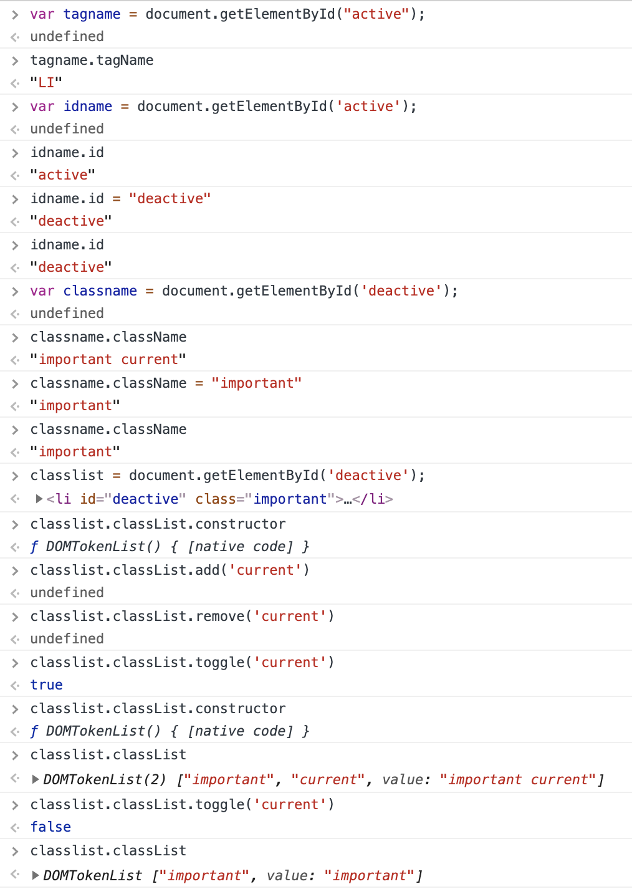
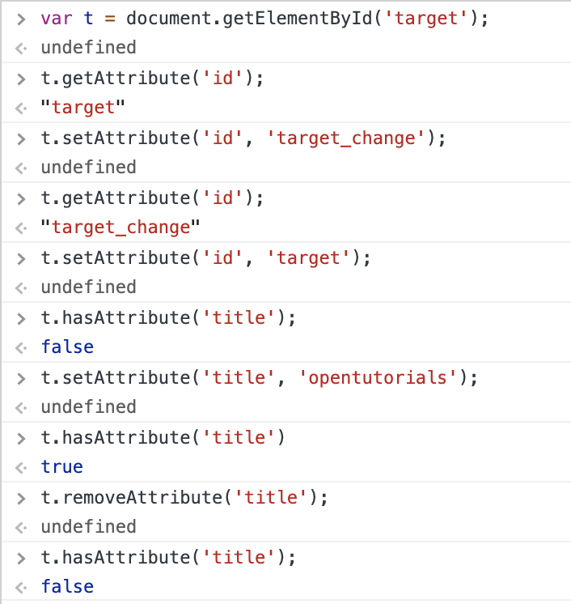

# ElEMENT API

* html의 모든 객체는 HTMLELEMENT의 하위 계층에 존재하며 HTMLELEMENT의 상위에는 ELEMENT가 존재한다.
* 따라서 모든 html 객체는 ELEMENT가 가지고 있는 메서드를 사용할 수 있다. 즉 ELEMENT가 제공하는 api를 사용할 수 있다.

## 식별자 api

> Element 객체가 가지고 있는 식별자를 가져오며 변경할 수 있다.

element 즉 제어 대상자를 찾는것이 아니라 이미 알고 있는 대상자에 대해서 관련 정보를 조회하는 것이다. 

* Element.tagName: 태그명을 조회한다. 변경할 수 없으며 조회하는 역할만 수행한다.
* Element.id: 태그의 id 값을 조회, 변경할 수 있다. 
* Element.className: 태그의 클래스명을 조회, 변경할 수 있다. 
* Element.classList: 태그의 클래스명을 domtokenlist 형태로 반환하기 때문에 domtokenlist의 메서드인 add, remove, toggle를 사용하여 클래스명을 다각도로 변경할 수 있다. 

## 조회 api

제어 대상자를 찾는 메서드인 `getElementBy*` 들을 의미하며 document객체와 element 객체 모두 가지고 있다.

### document.getElementBy* 메소드
* document 객체는 문서 전체를 의미하는 객체이다.
* 문서 전체를 대상으로 element를 찾게 된다.

### element.getElementBy* 메소드
* document가 아닌 특정 element로 조회를 하기 때문에 범위를 주르일 수 있다. 
* 어떤 객체의 하위 객체에서 찾을 때 유용하다.

## 속성 api

속성이란 태그의 이름만으로 정보를 나타내기 어려울 때 부가적으로 사용하는 기능이다. `attribute`

* Element.getAttribute(<속성>) : 속성의 값을 조회한다.
* Element.setAtribute(<속성>, <속성값>): 기존 속성값을 바꾸거나 새로 추가한다.
* Element.hasAttribute(<속성>): 속성의 존재 여부를 확인한다. 
* Element.removeAttribute(<속성>): 기존 속성을 삭제하는 방법 

### 속성(attribute) vs property

html에서는 태그와 속성으로 정보를 나타낸다. 따라서 html 내에서는 속성과 property가 가리키는 것은 태그 내의 부가적인 정보로 같은 것이다. 하지만 맥락에 따라서 달리 사용된다. 속성으로 불릴때는 태그 안의 또다른 정보를 나타내는 의미이며 porperty로 불릴때는 element가 가지고 있는 속성값이란 의미이다. 즉 poperty는 객체지향 관점에서 멤버 변수를 의미하는 뉘앙스가 나타난다. 또한 속성값을 바꿀때 element의 메서드를 사용할 시 속성이라는 단어가 사용되고 속성값에 직접 접근하여 변경할 시 poperty 라는 단어가 사용된다. 의미하는 바는 같지만 상황에 따라 다르게 뜻하게 된다. 

* 속성으로 접근한 경우와 property로 접근한 경우의 결과가 다를 수 있다. 
property로 접근한 경우 실제값을 나타내고 속성으로 즉 메서드로 접근한 경우 태그 내에 적힌 속성값으로 나타난다. 
~~~
<a id="target" href="./demo1.html">ot</a>

~~~

* property 로 접근한 경우 속성종류이름과 설정 문자열이 다를 수 있다. 

